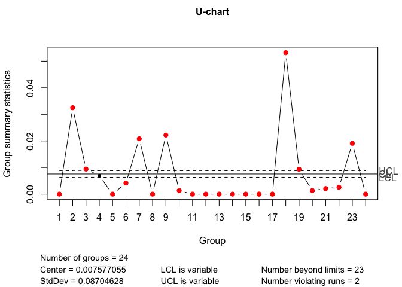
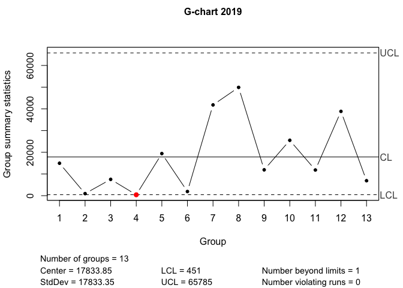

## Вычисления к статье

Ниже приводятся вычисления для построения графиков в статье "Применение контрольных карт для мониторинга аварийных прерываний ИТ-услуг"


```r
library(qcc)
```

```
## Package 'qcc' version 2.7
```

```
## Type 'citation("qcc")' for citing this R package in publications.
```

```r
library(readr)
require(lubridate)
```

```
## Loading required package: lubridate
```

```
## 
## Attaching package: 'lubridate'
```

```
## The following objects are masked from 'package:base':
## 
##     date, intersect, setdiff, union
```

```r
data <- read_csv("data.csv", col_types = cols(actualstart = col_datetime(format = "%Y-%m-%d %H:%M:%S"), actualfinish = col_datetime(format = "%Y-%m-%d %H:%M:%S")))
data<-data[order(data$actualstart),]
data$badtime<-data$actualfinish-data$actualstart
data$year<-year(data$actualstart)
data$month<-month(data$actualstart)
data$diff<-0
data$diff[-1]<- diff(data$actualstart)
uchart<-aggregate(badtime~month+year,data=data,sum)
uchart<-uchart[1:13,]
uchart<-rbind(uchart,data.frame(month=c(1,5,8,11,12),year=2018,badtime=0))
uchart<-rbind(uchart,data.frame(month=c(1:5,12),year=2019,badtime=0))
uchart$total<-days_in_month(uchart$month)*24*60
uchart<-uchart[order(uchart$year,uchart$month),]
old <- qcc.options() 
qcc.options(bg.margin="white")
qcc(uchart$badtime,sizes=uchart$total,type="u",title="U-chart")
```

<!-- -->

```
## List of 11
##  $ call      : language qcc(data = uchart$badtime, type = "u", sizes = uchart$total, title = "U-chart")
##  $ type      : chr "u"
##  $ data.name : chr "uchart$badtime"
##  $ data      : num [1:24, 1] 0 1310 420 300 0 180 930 0 960 60 ...
##   ..- attr(*, "dimnames")=List of 2
##  $ statistics: Named num [1:24] 0 0.03249 0.00941 0.00694 0 ...
##   ..- attr(*, "names")= chr [1:24] "1" "2" "3" "4" ...
##  $ sizes     : num [1:24] 44640 40320 44640 43200 44640 ...
##  $ center    : num 0.00758
##  $ std.dev   : num 0.087
##  $ nsigmas   : num 3
##  $ limits    : num [1:24, 1:2] 0.00634 0.00628 0.00634 0.00632 0.00634 ...
##   ..- attr(*, "dimnames")=List of 2
##  $ violations:List of 2
##  - attr(*, "class")= chr "qcc"
```

```r
qcc(data$diff[25:37], type="g",title="G-chart 2019",confidence.level=0.95)
```

<!-- -->

```
## List of 11
##  $ call            : language qcc(data = data$diff[25:37], type = "g", confidence.level = 0.95, title = "G-chart 2019")
##  $ type            : chr "g"
##  $ data.name       : chr "data$diff[25:37]"
##  $ data            : num [1:13, 1] 14940 950 7515 415 19395 ...
##   ..- attr(*, "dimnames")=List of 2
##  $ statistics      : Named num [1:13] 14940 950 7515 415 19395 ...
##   ..- attr(*, "names")= chr [1:13] "1" "2" "3" "4" ...
##  $ sizes           : int [1:13] 1 1 1 1 1 1 1 1 1 1 ...
##  $ center          : num 17834
##  $ std.dev         : num 17833
##  $ confidence.level: num 0.95
##  $ limits          : num [1, 1:2] 451 65785
##   ..- attr(*, "dimnames")=List of 2
##  $ violations      :List of 2
##  - attr(*, "class")= chr "qcc"
```

```r
qcc.options(old)
```

## Расчеты статистики


```r
library(ADGofTest)
(ad.test(data$diff[25:37],pgeom,prob=1/mean(data$diff[25:37])))
```

```
## 
## 	Anderson-Darling GoF Test
## 
## data:  data$diff[25:37]  and  pgeom
## AD = 0.30819, p-value = 0.9308
## alternative hypothesis: NA
```

```r
(log(0.025)/(log(1-1/17833.85))-1)
```

```
## [1] 65784.08
```

```r
(log(1-0.025)/(log(1-1/17833.85)))
```

```
## [1] 451.5013
```

